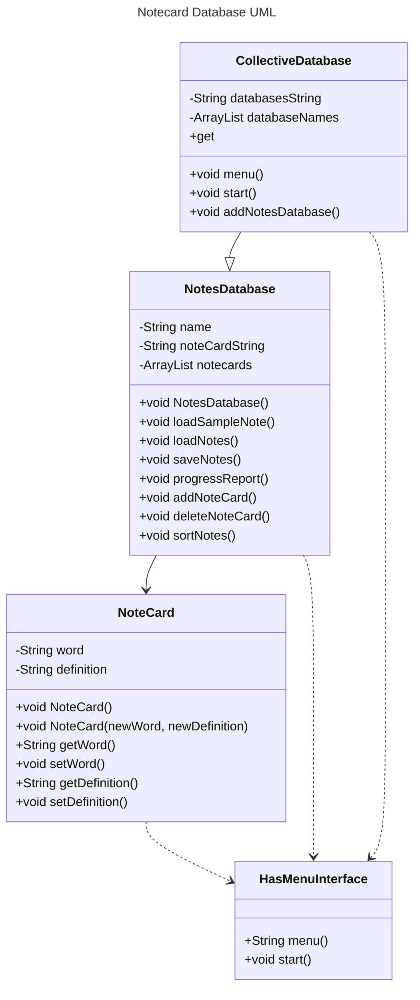

# FinalProjectCS121 Documentation


## Initial Ideas
- Rating people, storing in database, type names and leave comments
- Note cards programming and testing yourself
- Calendar creator storing events in specific months and then printing layout


## Summary of the Project


### Title: 
Note Card Databases Final Project

### Longer description of the project in paragraph form: 
Creating a database where you can create sets of notcards with words and definitions.
The user will have a menu that allows them to either open up a notecard database that they named or create a new note card data base. If they choose to open a notecard database there will be a list of notecard databases they can choose from. These will be their previously created databases. In the notecard database they have opened up, they can create new notecard, delete note card, check notecard scores, or quiz themself on that database. The quix will type out the definition of a random note card and ask them what the word is. If their answer is correct they will gain 1 correct point and if their answer is incorrect then they will gain 1 incorrect point for that notecard. After each question a menu will say, continue or exit quiz. After they exit the quiz, they can choose check notecard scores and the system will print out each notecard word with the number of correct answers and number of incorrect answers, sorted showing the most incorrect answers first. From the new data base selection, they can create the database name or it will automatically be assigned a name, or they can add note cards, which will require adding a word and then a definition.

### A discussion of the intended users and Thoughts about exactly which problems this project is meant to solve:
This will be helpful for creating your own set of notecards when you need to memorize the words when shown the definitions. It is also helpful to have multiple databases of different notecard sets for different testing subjects you may need to remember. This would be useful for college or high school students. I think it could also be helpful to be able to keep track of which defintions you have the most trouble with. Then you could either delete the ones you have memorized well, or create new database specifically for ones you struggle to remember since rewriting could help as well. 

### Some thought about the technologies and structures you will need:
I think this will be similar formatting to the Bank project where I will use inheritance, templates, abstract classes, file saving, etc. to create a system that holds the memory of the notcards and only opens new classes of data when necessary based off the initial class.


## Elevator Pitch 
My project is meant to be an easy way to store and access databases of note cards for students who want to help themselves remember terms by both typing out the informationa and quizzing themselves over th information. These databases will keep track of how many times you get terms incorrect so that you can use that information to either delete the ones you have mastered or create a new database with the terms you are struggling to remember. This is an easy way to start your study process especially with complicated terminology that may be hard to remember. 


## UI Design 
As of right now I do not have the intention to create multiple userfaces just because I already have a lot I want to do within my multiple menus. I think my first step in implementing design would be to make th menu more appealing and the layout of the note cards when they are printed. First I would space things out in an appealing way, then I would create lines from text dashes to separate menus from the next menus or text that arrives on screen. Then I would try to see if I could create headings for different types of menus and make those headings bold and possibly bigger. Maybe I could change the background color.


## Data Design 
The notecard databases will need to be persistent which will be achieved by serializing the classes involved. This will need to be broken into smaller companents like the bank on it project. I will be useing the bank on it project as reference if I get lost trying to plan out this many ideas. I will use the bank on it UML to help me create what I think my UML should look like.


## UML Diagram



# The Rest of the Planning that isn't Completed Yet:


## Algorithm 
Generally, each data element will be a class, and each screen of a GUI system will also be a class. For each class in your project:

### HasMenu.java I already wrote previously:
```
public interface HasMenu {
	public String menu();
	public void start();
	public static long serialVersionUID = 1L;

} // end interface
```

### NoteCard Class
private atrributes:
- a String called word
- a String called definition
- an int called correct
- an int called incorrect
public methods:
- Void no paramater constructor
- Void initializer with newWord and newDefinition parameters
- getWord that returns the String word
- Void setWord that creates the String word
- getDefinition returns String definition
- Void setDefinition creates the String defintion
- getCorrect that converts correct to String and returns it
- getIncorrect that converts incorrect to String and returns it
- Void setCorrect which adds one to correct
- Void setIncorrect which adds one to incorrect

### NotesDatabase Class
private attributes: 
- a String called name
- a String called noteCardString
- an ArrayList called noteCards
public methods:
- Void no parameter constructor
- Void loadSampleNote for testing
- Void loadNotes to load in file of note cards
- Void saveNotes to save to a file the note cards
- menu that returns a String that indicates what is next in the start loop
- Void start loop to choose between create new notecard, delete note card, check notecard scores, or quiz on the database
- Void progressReport that prints out the word, incorrect, and correct for each notecard
- Void addNoteCard that creates a new note card and adds it to the ArrayList and noteCardString
- Void deleteNoteCard that deletes a note card and removes it from ArrayList and noteCardString
- Void sortNotes which sorts the order note cards are printed in for progressReport
- Void quiz which runs a loop that randomly prints the definition of notecards that user needs to type the word to and adds to incorrect/correct for those cards


### CollectiveDatabase Class
private attributes:
- a String called databasesString
- an ArrayList called databaseNames
public methods:
- menu return answer for the start loop
- chooseDatabase prints the list of database names and returns user choice
- Void start loop to choose between open a database they already made or create a new database
- Void addNotesDatabase creates a new database
  

### Define the data members - what are the key data elements of the class
- Describe the initializer - Initializers typically create and populate the data members.  Will your constructors take parameters? have default values?
- Describe any other housekeeping that may need to happen in the constructor - initializer
- Define access methods for all data members. Build all appropriate getters and setters with filters as needed.
- Identify any methods your class will need beyond access methods
- Flesh out each method as a function - write any pseudocode that is not trivial or obvious
- Consider how you will test your class.  Write a test function (in C/C++ or test in a main method in Java)

### For every function or method of your code:
- Define the main concept of the function
- Determine what parameters the function takes in
- Describe the output of the function (or void if it returns no output)
- Describe the steps of the function in enough detail that you should be able to convert to code in your preferred language

